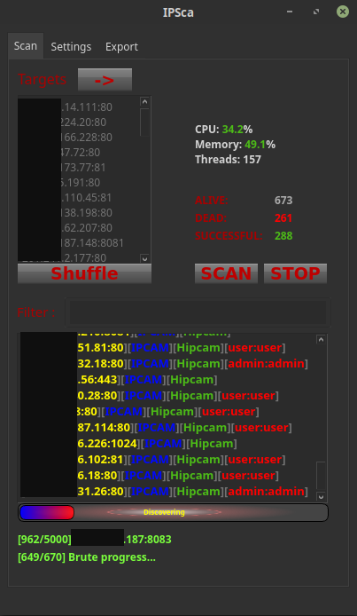

# IPSca

- Universal scanner for web interfaces of IoT devices
- Brute force function is embedded
- Graphic interface

## Requirements
- Python >= 3.6 - install
- Python modules: `pip3 install -r requirements.txt`

## Features
- Masscan is embedded (root required)
- Import host-file parsed using shodan without manual parsing. `shodan parse --fields ip_str,port ~/download.json.gz > hosts.txt`
- Export to: json, csv, html (ipcam screenshots)

## Disclaimer
- For educational use only
